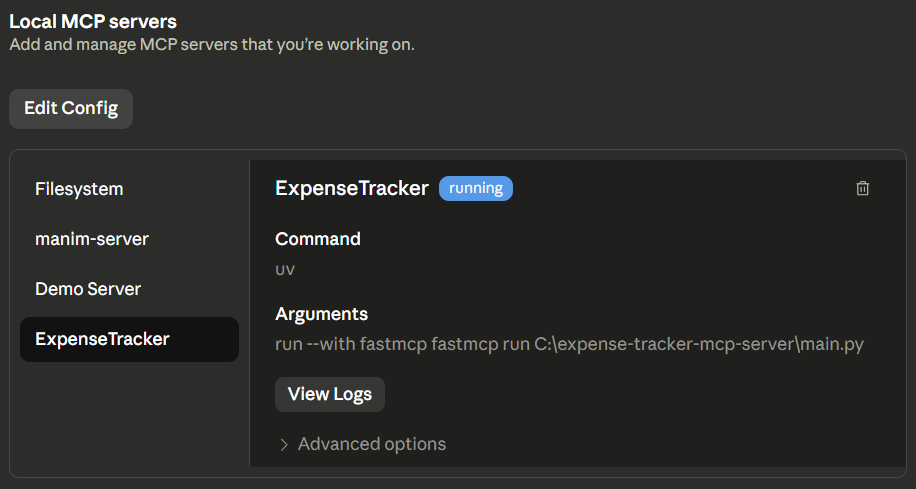
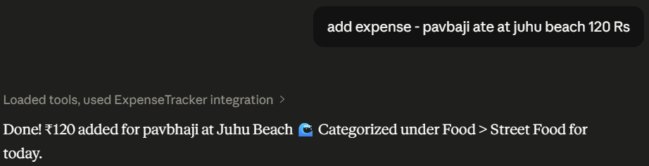
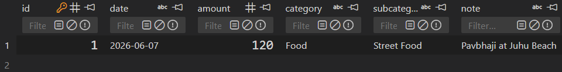
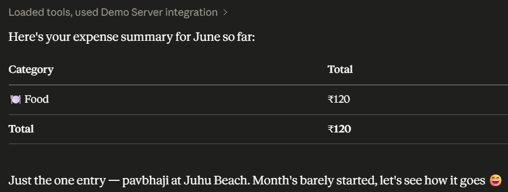

<p align="center">
  
</p>

---

<h3 align="center">An MCP Server for Managing Personal Expenses Through AI Assistants</h3>

---

## 📌 Project Overview

Expense Tracker MCP Server is a Model Context Protocol (MCP) server that enables AI assistants such as Claude Desktop and other MCP-compatible clients to manage personal expense records through natural language.

The project provides a set of tools for adding, viewing, updating, deleting, and analyzing expenses stored in a SQLite database.

Instead of manually interacting with spreadsheets or expense management applications, users can simply ask their AI assistant to record and retrieve financial information using natural language.

---

## 📈 Application Preview

### MCP Server Running



### Claude Desktop Integration



### Adding an Expense



### Viewing Expenses



### Expense Summary


---

## 🎯 Problem Statement

Personal expense tracking often requires users to manually enter and manage records across multiple applications.

The challenge was to:

* Create a lightweight expense management system accessible through AI assistants
* Enable natural language interaction with expense data
* Store expense records efficiently using SQLite
* Provide spending summaries and analytics
* Integrate seamlessly with MCP-compatible clients

This project demonstrates how MCP servers can expose structured financial tools directly to AI assistants.

---

## ⚙️ Tools & Technologies Used

* **Python** – Core programming language
* **FastMCP** – MCP server framework
* **SQLite** – Lightweight database storage
* **UV** – Dependency and environment management
* **Claude Desktop** – MCP client integration
* **JSON** – Tool communication format

---

## 🧱 Workflow Architecture

```text
User Query
      │
      ▼
Claude Desktop / MCP Client
      │
      ▼
Expense Tracker MCP Server
      │
      ├── Add Expense
      ├── View Expenses
      ├── Update Expense
      ├── Delete Expense
      └── Generate Summary
      │
      ▼
SQLite Database
      │
      ▼
Response Returned to AI Assistant
```

---

## 📊 Features Implemented

### ➕ Add Expense

Store new expense records with:

* Amount
* Category
* Description
* Date

---

### 📋 View Expenses

Retrieve all stored expenses from the database.

---

### ✏️ Update Expense

Modify existing expense records.

---

### ❌ Delete Expense

Remove expense entries by ID.

---

### 📊 Expense Summary

Generate category-wise spending breakdowns.

---

### 💰 Total Spending

Calculate total expenses across all records.

---

## 📂 Project Structure

```text
expense-tracker-mcp/
│
├── main.py
├── expenses.db
├── requirements.txt
├── pyproject.toml
│
├── database/
│   └── database.py
│
├── tools/
│   ├── add_expense.py
│   ├── view_expenses.py
│   ├── update_expense.py
│   ├── delete_expense.py
│   └── summary.py
│
├── images/
│   ├── 1.png
│   ├── 2.png
│   ├── 3.png
│   ├── 4.png
│   └── 5.png
│
└── README.md
```

---

## 🔧 Available MCP Tools

| Tool            | Description                     |
| --------------- | ------------------------------- |
| Add Expense     | Create a new expense record     |
| View Expenses   | Retrieve stored expenses        |
| Update Expense  | Modify an existing expense      |
| Delete Expense  | Remove an expense               |
| Expense Summary | Category-wise spending analysis |
| Total Spending  | Calculate overall expenses      |

---

## ▶ How to Run the Project

### 1. Clone Repository

```bash
git clone https://github.com/Pratham1603/expense-tracker-mcp.git

cd expense-tracker-mcp
```

### 2. Create Virtual Environment

```bash
uv venv
```

### 3. Activate Environment

Windows:

```bash
.venv\Scripts\activate
```

Linux/macOS:

```bash
source .venv/bin/activate
```

### 4. Install Dependencies

```bash
uv sync
```

### 5. Start MCP Server

```bash
uv run main.py
```

---

## ⚙️ Claude Desktop Configuration

Add the following MCP configuration:

```json
{
  "mcpServers": {
    "expense-tracker": {
      "command": "uv",
      "args": [
        "--directory",
        "PATH_TO_PROJECT",
        "run",
        "main.py"
      ]
    }
  }
}
```

Replace:

```text
PATH_TO_PROJECT
```

with the absolute path to your project directory.

---

## 💬 Example Usage

### Add Expense

```text
Add an expense of ₹250 for coffee.
```

### Show Expenses

```text
Show all my expenses.
```

### Spending Analysis

```text
How much did I spend on food this month?
```

### Delete Expense

```text
Delete expense ID 4.
```

---

## 📦 Requirements

```text
fastmcp
sqlite3
python-dotenv
```

Install all dependencies:

```bash
pip install -r requirements.txt
```

---

## 💡 Key Learning Outcomes

* Understanding the Model Context Protocol (MCP)
* Building AI-accessible backend tools
* Working with FastMCP servers
* Managing structured data using SQLite
* Integrating custom tools with Claude Desktop
* Designing natural language interfaces for data management

---

## 🚀 Future Improvements

* Budget planning
* Monthly spending reports
* Expense visualization dashboard
* CSV export functionality
* Multi-user support
* Authentication layer
* Cloud database integration
* AI-powered spending insights

---

## 🔗 Important Links

### GitHub Repository

https://github.com/Pratham1603/expense-tracker-mcp

### MCP Documentation

https://modelcontextprotocol.io

### FastMCP Documentation

https://gofastmcp.com

---

## 🙌 Contributing

Contributions are welcome.

1. Fork the repository
2. Create a feature branch

```bash
git checkout -b feature/new-feature
```

3. Commit changes

```bash
git commit -m "Add new feature"
```

4. Push branch

```bash
git push origin feature/new-feature
```

5. Open a Pull Request

---

## ⭐ Support

If you found this project useful, consider giving the repository a star.

---

<p align="center">
Made with ❤️ by <b>Pratham Harer</b>
</p>
